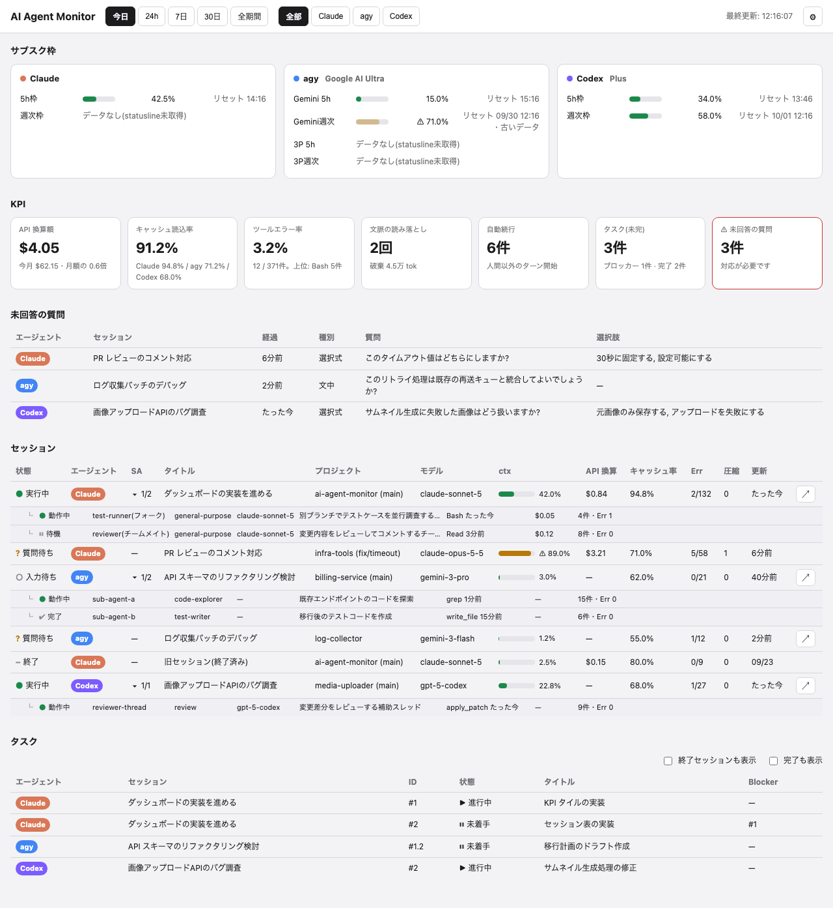

# AI Agent Monitor

Claude Code、Codex、Antigravity CLI(`agy`)の稼働状況を、ローカルのログから集計して表示するダッシュボードです。



- API 換算額、キャッシュ読込率、ツールエラー率、文脈の圧縮、自動続行、作業時間、タスク、未回答の質問を KPI として表示します
- サブスクリプションの使用枠(5 時間枠・週次枠)と、セッションごとのコンテキスト使用率・開始時刻・作業時間を表示します
- セッション、サブエージェント、タスク(ID・状態・タイトル・Blocker)、未回答の質問を表で一覧できます
- セッション表はリポジトリ(git worktree を含む)ごとにまとめて表示できます(「まとめ方: [なし | プロジェクト]」で切り替え)
- セッションの行をクリックすると、タスクと未回答の質問をそのセッションの分だけに絞り込めます
- 画面右上の ⚙ から、監視するエージェントの選択やセッション表の列の表示・非表示を切り替えられます(列の表示設定はブラウザごとに保存)
- 端末管理アプリ Orca で動かしているセッションなら、行の ↗ ボタンでその端末タブに切り替えられます

API キーやネットワーク接続は使いません。手元に残るログを読むだけで、ログへの書き込みもしません。

## 必要なもの

- Node.js 22.13 以上(24 で動作確認)
- macOS または Linux(WSL2 を含む)
  - プロセス情報の取得に `ps` を使っています。Linux では procps(procps-ng)版の `ps` が必要です(Ubuntu や Debian などは標準)
- Windows(ネイティブ)
  - プロセス情報の取得に PowerShell の `Get-CimInstance` を使っています。どちらも Windows 標準です
- 依存パッケージはありません

WSL2 で使うときは次の点に注意してください。

- WSL 側で動かしているエージェントのログだけを集計します。Windows ネイティブで動かしているエージェントのログは読みません
- 画面は Windows 側のブラウザから `http://127.0.0.1:4777/` で開けます(WSL2 の localhost 転送が有効な場合)
- WSL のターミナルをすべて閉じると、しばらくして WSL ごとダッシュボードも止まります

Windows(ネイティブ)で使うときは次の点に注意してください。

- Windows ネイティブで動かしているエージェントのログだけを集計します。WSL 側で動かしているエージェントのログは読みません
- ログの場所の `~` は `%USERPROFILE%`(`C:\Users\<ユーザー名>`)です
- Orca の ↗ ボタンは出ません
- PowerShell で `npm` が「このシステムではスクリプトの実行が無効になっている」というエラーになる場合は、`npm.cmd run setup-statusline` のように `npm.cmd` を使うか、`node src/setup-statusline.js` のように直接実行してください

## 起動

```sh
npm start
```

`http://127.0.0.1:4777/` を開きます。画面は 5 秒ごとに更新されます。

```sh
node src/server.js --port 4800            # ポートを変える
node src/server.js --json --range 7d      # 集計結果を JSON で出力して終了
```

`--range` は `today` / `24h` / `7d` / `30d` / `all`、`--agent` は `all` / `claude` / `agy` / `codex` です。

```sh
node src/server.js --agents claude,codex  # 監視するエージェントを指定する(画面の設定より優先)
```

## バックグラウンドサービスとして常駐させる

開発作業(ブランチ切り替えやコード編集)の影響を受けずに、ログイン時に自動起動して常駐させることができます。専用の安定版ディレクトリ(macOS/Linux: `~/.local/share/ai-agent-monitor`、Windows: `%APPDATA%\ai-agent-monitor`)にコードが配置され、バックグラウンドで稼働します。

### 登録と起動(インストール)

```sh
npm run service:install
```

- **macOS**: `~/Library/LaunchAgents/com.kuninet.ai-agent-monitor.plist` を作成・登録し、ログイン時の自動起動とプロセス監視を開始します。
- **Windows**: タスクスケジューラに登録し、ログオン時にバックグラウンドで自動起動します。

### 稼働状態の確認

```sh
npm run service:status
```

### サービスの再起動

```sh
npm run service:restart
```

### 最新コードのデプロイ

現在のリポジトリの最新コードを安定版ディレクトリに同期し、サービスを自動再起動します。

```sh
npm run service:deploy
```

### サービスの解除(アンインストール)

```sh
npm run service:uninstall
```

ログは `~/.ai-status/server.log`(標準出力)および `~/.ai-status/server.err.log`(エラー出力)に出力されます。

## 監視するエージェントの選択

画面右上の ⚙ から、監視するエージェントを選べます。選んだ内容は `~/.ai-status/config.json` に保存され、次回の起動でも使われます。外したエージェントのログは読みません。

設定が無いときは、ログのディレクトリがあるエージェントをすべて監視します。起動オプション `--agents` を指定した場合はそちらが優先され、画面からは変更できません。

## 使用枠(5 時間枠・週次枠)を表示する設定

使用枠の値は statusline に渡される JSON にしか含まれないため、保存する設定が要ります。

### Claude Code

このリポジトリで `npm run setup-statusline` を実行してください。この設定が無くても、使用枠以外の項目は表示されます。

変更前と変更後の `command` を表示し、確認のうえ `~/.claude/settings.json` の `statusLine.command` に保存用スクリプトを挟みます。書き込む前に元のファイルを `settings.json.bak` に保存します。`CLAUDE_CONFIG_DIR` を設定している場合は、そのディレクトリの `settings.json` が対象です。元に戻すときは `npm run setup-statusline -- --remove` を実行します。

仕組みは次のとおりです。Claude Code が statusline に渡す JSON を、同梱の `src/statusline-save.js` が `~/.ai-status/claude/<session_id>.json` に保存し、`--tee` を付けた場合はそのまま今の statusline のスクリプトに渡します。今のスクリプトは書き換えずに済みます。

```
Claude Code → statusline-save.js --tee → 今の statusline のスクリプト
                    ↓
          ~/.ai-status/claude/<session_id>.json
```

保存に失敗しても何も出力せず正常終了するので、statusline の表示は妨げません。

#### 手で設定する場合

statusline を使っている場合は、今の `command` の前に `node /path/to/ai-agent-monitor/src/statusline-save.js --tee | ` を付けます(`/path/to/ai-agent-monitor` はこのリポジトリの場所に読み替えてください)。

```json
{
  "statusLine": {
    "type": "command",
    "command": "node /path/to/ai-agent-monitor/src/statusline-save.js --tee | ~/.claude/statusline.sh"
  }
}
```

statusline を使っていない場合は、次のように登録します。保存するだけなので、statusline には何も表示されません。

```json
{
  "statusLine": {
    "type": "command",
    "command": "node /path/to/ai-agent-monitor/src/statusline-save.js"
  }
}
```

Windows ではパスを `C:/Users/<ユーザー名>/git/ai-agent-monitor/src/statusline-save.js` のようにスラッシュで書いてください。パスに空白を含む場合は `"` で囲みます。

statusline のスクリプトの中から呼ぶこともできます。

```sh
input=$(cat)
printf '%s' "$input" | node /path/to/ai-agent-monitor/src/statusline-save.js
```

### Codex

設定は不要です。使用枠は会話記録に含まれています。

### Antigravity CLI

このリポジトリで `npm run setup-statusline -- --agy` を実行してください。使用枠のほか、セッションごとのコンテキスト使用率とモデル名もこの設定で表示されるようになります。設定が無くても、会話やツールの集計は表示されます。

変更前と変更後の `command` を表示し、確認のうえ `~/.gemini/antigravity-cli/settings.json` の `statusLine.command` に保存用スクリプトを挟みます。書き込む前に元のファイルを `settings.json.bak` に保存します。`statusLine` が無い場合は、保存だけを行う `statusLine` を `"enabled": true` で追加します。`"enabled": false` になっている場合は書き換えないので、agy の設定で有効にしてください。元に戻すときは `npm run setup-statusline -- --agy --remove` を実行します。agy は設定を起動時にしか読まないので、設定したあとは agy を起動し直してください。

agy が statusline に渡す JSON を、`src/statusline-save.js --agy` が `~/.ai-status/agy/<conversation_id>.json` に保存します。メールアドレスは保存前に取り除きます。statusline に何を表示するかは関係ありません。保存は agy が statusline を呼ぶたびに行われるので、ダッシュボードが止まっている間の分も残ります。

Windows の agy は statusline のコマンドをシェルを通さずに実行するため、パイプや引用符は使えません。そこで Claude Code の場合と違い、`statusline-save.js --agy -- <今のコマンド>` の形にして、`--` より後ろの今のコマンドを `statusline-save.js` が起動し、入力を渡します。このため、`statusline-save.js` のパスに空白が含まれる場合は設定できません(`setup-statusline` は書き込まずに理由を表示します)。以前の `--agy --tee | ` の形で設定してある場合は、`npm run setup-statusline -- --agy` を実行すると今の形への書き換えを提案します。

```
agy → statusline-save.js --agy -- 今の statusline のスクリプト
                    ↓
          ~/.ai-status/agy/<conversation_id>.json
```

#### 手で設定する場合

`~/.gemini/antigravity-cli/settings.json` の `statusLine.command` の前に `node /path/to/ai-agent-monitor/src/statusline-save.js --agy -- ` を付けます。statusline を使っていない場合は、`command` を `node /path/to/ai-agent-monitor/src/statusline-save.js --agy` にします。Windows ではパスを `C:/Users/<ユーザー名>/git/ai-agent-monitor/src/statusline-save.js` のようにスラッシュで書き、引用符で囲まないでください。今のコマンドも、引用符やパイプを使わない形にしてください。

```json
{
  "statusLine": {
    "type": "command",
    "command": "node /path/to/ai-agent-monitor/src/statusline-save.js --agy -- node /path/to/statusline.js",
    "enabled": true
  }
}
```

自作の statusline スクリプトで入力を `~/.gemini/antigravity-cli/last_statusline_input.json` に書き出している場合は、そのファイルも引き続き読みます。

#### タスクの表示

agy のタスクは、agy が会話ごとに書く `task.md` から読みます。agy は Planning Mode で作業するときに `task.md` を作るので、タスクを表示したいときは依頼の頭に `/plan` を付けてください。調べものなど、計画が要らないと agy が判断した依頼では作られないことがあります。

## 読み込むファイル

| 対象                           | 場所                                                                                                        |
| ------------------------------ | ----------------------------------------------------------------------------------------------------------- |
| Claude Code の会話記録         | `~/.claude/projects/**/*.jsonl`(サブエージェントを含む)                                                     |
| Claude Code の実行中セッション | `~/.claude/sessions/*.json`                                                                                 |
| Claude Code のタスク           | `~/.claude/tasks/` と会話記録内の `TaskCreate` / `TaskUpdate` / `TodoWrite`                                 |
| Codex の会話記録               | `~/.codex/sessions/**/rollout-*.jsonl`                                                                      |
| Codex のスレッド一覧           | `~/.codex/state_*.sqlite`                                                                                   |
| agy の会話記録                 | `~/.gemini/antigravity{,-cli}/brain/<id>/.system_generated/logs/transcript.jsonl`                           |
| agy のタスク                   | `~/.gemini/antigravity{,-cli}/brain/<id>/task.md`                                                           |
| agy の会話一覧                 | `~/.gemini/antigravity{,-cli}/conversation_summaries.db`                                                    |
| agy の statusline 入力         | `~/.ai-status/agy/<conversation_id>.json` と、あれば `~/.gemini/antigravity-cli/last_statusline_input.json` |

ダッシュボードが書き込むのは `~/.ai-status/` の中だけです。画面で選んだエージェントを `config.json` に保存します。`last_statusline_input.json` がある場合は、その内容を会話ごとに `~/.ai-status/agy/` へ写し、メールアドレスは保存前に取り除きます。statusline から `src/statusline-save.js` を呼ぶよう設定した場合は、その入力が `~/.ai-status/claude/`(`--agy` 付きなら `~/.ai-status/agy/`)に保存されます。`npm run setup-statusline` は、確認のうえ `~/.claude/settings.json`(`--agy` 付きなら `~/.gemini/antigravity-cli/settings.json`)とそのバックアップ `settings.json.bak` に書き込みます。

各指標の定義と判定ルールは [docs/DESIGN.md](docs/DESIGN.md) にまとめています。

## 注意

- API 換算額は、会話記録のトークン数に API の公開単価を掛けた概算で、請求額ではありません。サブスクリプションで使っている場合は、⚙ からプランの月額を設定すると「今月の換算額が月額の何倍か」を表示します。会話記録に残らない呼び出しもあるため、実際より少なめに出ることがあります
- Codex と agy は定額制のため API 換算額を出さず、使用枠を表示します
- agy を `agy -c` や引数なしで起動した場合は、statusline の保存ファイルから、どの会話を動かしているかを推定します(`npm run setup-statusline -- --agy` の設定が必要です)。同じディレクトリで複数の agy を使うと、会話の対応を誤ったり、「動作中」と表示されなかったりすることがあります。確実に判別するには `--conversation <会話ID>` 付きで起動してください
- Codex は 1 つのプロセスが複数の会話を扱うため、実行中かどうかは会話記録の更新から推定しています。デスクトップアプリや VS Code 拡張が起動している間は、閉じた会話も最後の更新から 30 分間は「入力待ち」と表示されます
- 作業時間は、会話記録の時刻から推定した、エージェントが作業していた時間です。人の入力待ちや放置の時間は含めません。記録が 30 分を超えて途切れた間(承認待ちや、出力を出さずに長く動く処理)は数えず、30 分未満の承認待ちは作業時間に含まれます
- 会話記録の形式はどのツールでも公開仕様ではありません。バージョンによって表示が崩れることがあります
- サーバーは `127.0.0.1` にだけ bind します。会話のタイトルや質問文を表示するので、外部に公開しないでください

## ライセンス

MIT
